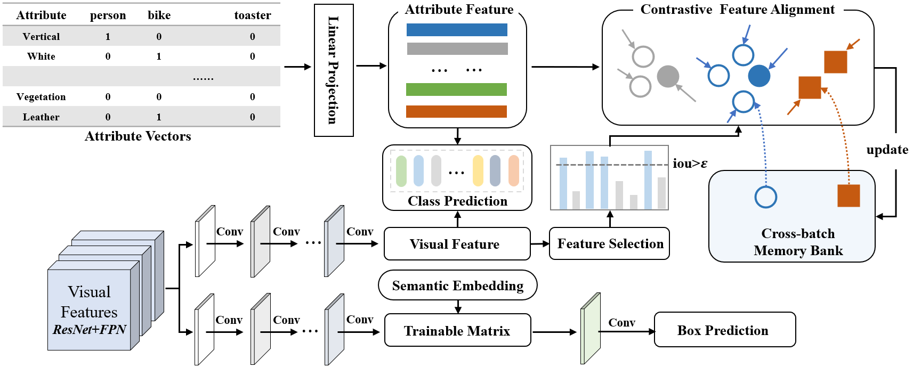

# Zero-shot Object Detection with Partitioned Contrastive Feature Alignment

## Requirements

* Other requirements:
    - Python 3.6
    - Keras 2.1.4
    - OpenCV 4.5.1
    - Tensorflow 1.14.0
 
## Files

* `sample_input.txt`: a sample input file containing test image paths
* `gzsd.py`: to perform generalized zero-shot detection task using sample_input.txt
* `keras_retinanet`: directory containing the supporting code of the model. This directory is a modified version from original RetinaNet implementation [1] ([Link](https://github.com/fizyr/keras-retinanet))
    - `bin/evaluate_attribute.py`: use this file to evaluate the trained PCFA-ZSD network on MSCOCO dataset
    - `bin/evaluate_attribute_unseen.py`: use this file to evaluate the trained PCFA-ZSD network on unseen classes of MSCOCO dataset
* `Dataset`: directory containing sample input and output images. For training, you will have to place train and val datasets in this directory.
* `Config`: directory containing configuration files to set up conda environment.
* `MSCOCO`: This directory contains the source of data, proposed 65/15- seen/unseen split and experimental protocol used in experiments.
    - `cls_names_seen_coco.csv`: list of 65 MSCOCO seen classes. Each line contains a class name followed by an index.
    - `cls_names_test_coco.csv`: list of 80 MSCOCO object classes. Each line contains a class name followed by an index. Index 0 to 64 are from seen objects, and index 65 to 79 are from unseen.
    - `cls_names_test_coco_unseen.csv`: list of 15 MSCOCO unseen object classes. Each line contains a class name followed by an index. 
    - `train_coco_seen_all.zip`: it is a zip version of csv file `train_coco_seen_all.csv` containing training image paths and annotations used in the paper. Each line contains a training image path, a bounding box co-ordinate and the ground-truth class name of that bounding box. For example, Filepath,x1,y1,x2,y2,class_name
    - `validation_coco_seen_all.csv`: test images with annotations for traditional object detection on only seen objects. File format, Filepath,x1,y1,x2,y2,class_name
    - `validation_coco_unseen_all.csv`: test images with annotations for zero-shot object detection on only unseen objects. File format, Filepath,x1,y1,x2,y2,class_name
    - `validation_coco_unseen_seen_all_gzsd.csv`: test images with annotations for generalized zero-shot object detection on both seen and unseen objects together. File format, Filepath,x1,y1,x2,y2,class_name
    - `word_w2v.txt`: word2vec word vectors[2] ([Link](https://github.com/salman-h-khan/PL-ZSD_Release)) for 80 classes of MSCOCO.  The ith column represents the 300-dimensional word vectors of the class name of the ith row of `cls_names_test_coco.csv`
    - `attribute.txt`: attribute vectors[3] for 80 classes of MSCOCO.  The ith column represents the 79-dimensional attribute vectors of the class name of the ith row of `cls_names_test_coco.csv`
    
## Running instructions
* **Running Demo Code:** To run generalized zero-shot detection on sample input kept in `Dataset/Sampleinput`, simply run `gzsd.py` after installing all dependencies like Keras, Tensorflow, OpenCV or alternatively use the `.yaml` file (see above under `Requirements`) to create a new environment with all dependencies. Place the pre-trained model available from ([Link to pre-trained model for demo (h5 format)](https://drive.google.com/file/d/1VJTR5obiydVR1nbFw3RrHCuQ8osOXbmq/view?usp=sharing)) in the `Model` directory. This code will generate the output files for each input image to `Dataset/Sampleoutput`.
* **Running Train/Test Code on MSCOCO:** Extract the dataset `train2014.zip` and `val2014.zip` inside the folder Dataset. These files are downloadable from [Link](http://cocodataset.org/#download). Make sure the pre-trained model is present inside the Model folder ('Model/resnet50_csv_50_focal_seen_w2v.h5'). This pre-trained model is trained by focal loss on 65 seen classes without considering any vocabulary metric. This model is available to download from ([Link to pre-trained model for training (h5 format)](https://www.dropbox.com/s/dc0vit1dj83rd56/resnet50_csv_50_focal_seen_w2v.h5?dl=0)). Also, make sure the `snapshots` folder is already created to store intermediate models of each epoch. Then, run the following commands for training and testing.
- Testing GZSD: 
`python keras_retinanet/bin/evaluate_attribute.py csv MSCOCO/validation_coco_unseen_seen_all_gzsd.csv MSCOCO/cls_names_test_coco.csv snapshots/resnet50_csv_30.h5` 
- - Testing ZSD: 
`python keras_retinanet/bin/evaluate_attribute_unseen.py csv MSCOCO/validation_coco_unseen_all.csv MSCOCO/cls_names_test_coco_unseen.csv snapshots/resnet50_csv_30.h5` 

## Notes on MSCOCO experiments
The resources required to reproduce results are kept in the directory `MSCOCO`. For training and testing, we used MSCOCO-2014 train images from `train2014.zip` and validation images from `val2014.zip`. These zipped archives are downloadable from MSCOCO website ([Link](http://cocodataset.org/#download)). Please find the exact list of images (with annotations) used for "training" in `MSCOCO/train_coco_seen_all.csv`. The lists of images used for "testing" different ZSL settings are:
* For traditional detection task: `MSCOCO/validation_coco_seen_all.csv`, 
* For zero-shot detection task: `MSCOCO/validation_coco_unseen_all.csv`, and 
* For generalized zero-shot detection task: `MSCOCO/validation_coco_unseen_seen_all_gzsd.csv`.

## Reference
[1] Lin, Tsung-Yi, Priyal Goyal, Ross Girshick, Kaiming He, and Piotr Dollár. "Focal loss for dense object detection." IEEE transactions on pattern analysis and machine intelligence, 2018.

[2] Rahman, Shafin, Salman Khan, and Nick Barnes. "Improved visual-semantic alignment for zero-shot object detection." Proceedings of the AAAI Conference on Artificial Intelligence, 2020.

[3] Mao, Qiaomei, et al. "Zero-shot object detection with attributes-based category similarity." IEEE Transactions on Circuits and Systems II: Express Briefs, 2020.

## Acknowledgment
We thank the authors and contributors of [PL-ZSD](https://github.com/salman-h-khan/PL-ZSD_Release). 

